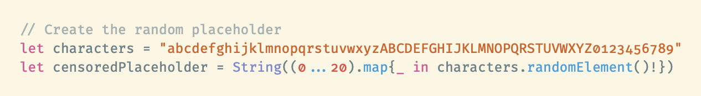

# [Fira Code], but with old style figures baked in

Want to use [Xcode with the Fira Code typeface] but also have a strange dedication to [olde timey numerals]?

As [explained] in the official Fira Code repository, some apps don't respect stylistic alternatives in typefaces, so we can force them into a copy of the font using [OpenType Feature Freezer].

[Fira Code]: https://github.com/tonsky/FiraCode
[Xcode with the Fira Code typeface]: https://github.com/CartoonChess/solarized-xcode-with-fira-code
[olde timey numerals]: https://en.wikipedia.org/wiki/Text_figures
[explained]: https://github.com/tonsky/FiraCode/wiki/How-to-enable-stylistic-sets
[OpenType Feature Freezer]: https://github.com/twardoch/fonttools-opentype-feature-freezer
